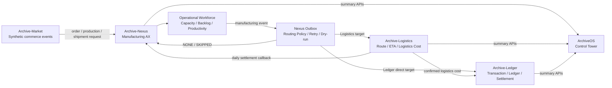

<p align="center">
  
</p>

# Archive-Nexus

Archive-Nexus는 제조·출하 이벤트를 생성하고, Archive-Market 주문을 생산 흐름으로 받아들이며, synthetic workforce capacity에 따라 생산 처리량·backlog·품질/정비 리스크를 계산하는 Manufacturing AX 백엔드입니다.

Nexus는 생성된 제조 이벤트를 Outbox에 저장한 뒤 `eventType` 기반 라우팅 정책에 따라 Archive-Logistics 또는 Archive-Ledger로 전달합니다. 외부 서비스가 disabled/down 상태여도 제조 API, simulator, dashboard가 중단되지 않도록 장애를 격리합니다.

> 모든 주문, 고객, 금액, 인력, 정산 데이터는 Synthetic Data / Demo Data입니다. 실제 고객 정보, 실제 결제 정보, 실제 배송 주소, 실제 직원/급여/개인정보를 저장하지 않습니다.

## 운영 역할

- Factory A/B/C 제조 runtime state 생성 및 조회
- Archive-Market 주문·생산·출하·취소·반품·클레임 이벤트 수신
- synthetic workforce allocation 기반 생산 capacity, backlog, productivity 계산
- 제조/품질/정비/출하 이벤트를 Outbox에 저장
- Logistics 이벤트는 Archive-Logistics로 전달
- 비용·정산성 이벤트는 Archive-Ledger로 직접 전달
- 비용 확정 전 이벤트는 `NONE/SKIPPED` 처리
- ArchiveOS가 읽을 수 있는 integrations, outbox, workforce, logistics settlement summary 제공

## Ecosystem Flow



## 핵심 기능

### 1. Manufacturing Runtime

- Factory A/B/C 생산, 품질, 정비, 재고, 물류 runtime state 유지
- simulator start/stop 및 dashboard API 제공
- PostgreSQL/JPA 기반 제조 데이터 영속화
- Prometheus/Grafana 관측 구조 유지

### 2. Archive-Market Inbound

Nexus는 Archive-Market의 synthetic commerce 이벤트를 수신하고, 필요한 경우 제조 Outbox 이벤트로 변환합니다.

| Market event | Nexus 처리 |
| --- | --- |
| `MARKET_ORDER_PLACED` | 주문 기반 제조 수요로 저장 |
| `PRODUCTION_REQUESTED` | workforce capacity를 소모해 `PRODUCTION_COMPLETED` 또는 `BACKLOG_INCREASED` 생성 |
| `SHIPMENT_REQUESTED` | `LOGISTICS_DISPATCHED` 또는 `SHIPMENT_HOLD_CREATED` 생성 |
| `ORDER_CANCELLED` | 출하 보류/취소 성격의 내부 이벤트 생성 |
| `RETURN_REQUESTED` | 품질/반품 관련 이벤트로 연결 |
| `QUALITY_CLAIM_CREATED` | `QUALITY_CLAIM_CHARGED` 또는 품질 이벤트로 연결 |

Market-origin payload의 `orderId`, `customerType`, `riskLevel`, `productType`, `quantity`, `orderAmount`, `priority`, `simulationRunId`, `settlementCycleId`, `correlationId`, `causationId`는 downstream 추적을 위해 outbox payload에 보존됩니다.

### 3. Operational Workforce

ArchiveOS 또는 Archive-Market이 synthetic workforce allocation을 배정하면 Nexus는 해당 capacity를 기준으로 생산 가능량과 backlog를 계산합니다.

| Role | 기본 의미 |
| --- | --- |
| `PRODUCTION_OPERATOR` | 생산 처리 capacity |
| `QUALITY_INSPECTOR` | 품질 검사 capacity 및 품질 리스크 |
| `MAINTENANCE_ENGINEER` | 정비 처리 capacity 및 downtime 리스크 |
| `MATERIAL_HANDLER` | 자재 처리 capacity |
| `FACTORY_MANAGER` | 운영 관리 capacity |

`archive.workforce.enabled=false`이면 기존 baseline capacity로 동작합니다. enabled 상태에서는 active allocation의 `effectiveCapacity`, `usedCapacity`, `remainingCapacity`를 실제로 소모합니다.

### 4. Outbox Routing

| Target | Event types | 설명 |
| --- | --- | --- |
| `LOGITICS` | `LOGISTICS_DISPATCHED`, `URGENT_DELIVERY_REQUESTED`, `SHIPMENT_HOLD_RELEASED`, `MATERIAL_TRANSFER_REQUESTED`, `QUALITY_REPLACEMENT_SHIPMENT` | Archive-Logistics가 route, ETA, 운송비, 지연/우회 비용 계산 |
| `LEDGER` | `PRODUCTION_COMPLETED`, `MATERIAL_CONSUMED`, `MAINTENANCE_COMPLETED`, `QUALITY_DEFECT_DETECTED`, `EMERGENCY_PURCHASE_REQUESTED`, `QUALITY_CLAIM_CHARGED`, `CORPORATE_CARD_USED`, `VENDOR_PAYMENT_REQUESTED` | Archive-Ledger가 거래·원장·정산·대사 처리 |
| `NONE` | `SHIPMENT_HOLD_CREATED`, `PRODUCTION_DELAYED`, `BACKLOG_INCREASED`, `MAINTENANCE_REQUIRED` | 비용 확정 전 또는 내부 운영 상태. 외부 publish 생략 |
| `UNKNOWN` | 지원하지 않는 eventType | publish하지 않고 routing skipped/failed evidence 기록 |

외부 표기는 `Archive-Logistics`로 통일합니다. 내부 호환 값인 `LOGITICS`, `logitics`, `ARCHIVE_INTEGRATIONS_LOGITICS_*`는 기존 DB/API/env 계약 유지를 위해 그대로 둡니다.

## 주요 API

### Outbox / Integration

| Method | Path | 설명 |
| --- | --- | --- |
| `GET` | `/api/outbox/summary` | Outbox 상태/target별 집계 |
| `GET` | `/api/outbox/events` | Outbox 이벤트 목록. `status`, `targetService` 필터 지원 |
| `GET` | `/api/outbox/events/{eventId}` | 단일 Outbox 이벤트 조회 |
| `POST` | `/api/outbox/events/generate?count=100&type=logistics` | synthetic 이벤트 생성 |
| `POST` | `/api/outbox/events/publish?target=auto&dryRun=true` | dry-run 라우팅 결과 확인 |
| `POST` | `/api/outbox/events/publish?target=logitics` | Logistics 대상 이벤트 publish |
| `POST` | `/api/outbox/events/publish?target=ledger` | Ledger 대상 이벤트 publish |
| `GET` | `/api/integrations/summary` | Archive-Logistics, Archive-Ledger, ArchiveOS, workforce summary |

### Archive-Market Inbound

| Method | Path | 설명 |
| --- | --- | --- |
| `POST` | `/api/events/market` | Archive-Market 단건 이벤트 수신 |
| `POST` | `/api/events/market/bulk` | Archive-Market 이벤트 batch 수신 |
| `GET` | `/api/events/market` | Market inbound 이벤트 목록. `status`, `limit` 필터 지원 |

### Workforce / Productivity / Capacity

| Method | Path | 설명 |
| --- | --- | --- |
| `POST` | `/api/workforce/allocations` | synthetic workforce allocation 수신 |
| `GET` | `/api/workforce/summary` | headcount, capacity, backlog, payroll cost summary |
| `GET` | `/api/productivity/summary` | 최신 workday productivity 결과 |
| `GET` | `/api/capacity/summary` | baseline 또는 allocation 기반 capacity summary |
| `POST` | `/api/workforce/workday/run?date=YYYY-MM-DD` | synthetic workday snapshot 생성 |

### Logistics Settlement Callback

| Method | Path | 설명 |
| --- | --- | --- |
| `POST` | `/api/logistics/settlements/daily` | Archive-Logistics의 synthetic daily manufacturing settlement 수신 |
| `POST` | `/api/logistics/settlements/daily/bulk` | settlement callback batch 수신 |
| `GET` | `/api/logistics/settlements` | 수신 settlement 목록 |
| `GET` | `/api/logistics/settlements/summary` | settlement callback summary |

### Platform / ArchiveOS

| Method | Path | 설명 |
| --- | --- | --- |
| `GET` | `/api/archiveos/status` | ArchiveOS availability status |
| `GET` | `/api/platform/manifest` | Archive Suite app manifest |
| `GET` | `/actuator/health` | Spring Boot health |
| `GET` | `/actuator/prometheus` | Prometheus metrics |

## 환경 변수

기본값은 로컬/demo 환경 기준입니다. 실제 secret, token, webhook, private key는 커밋하지 않습니다.

```powershell
# ArchiveOS
ARCHIVEOS_BASE_URL=http://host.docker.internal:4000

# Archive-Logistics integration
ARCHIVE_INTEGRATIONS_LOGITICS_ENABLED=true
ARCHIVE_INTEGRATIONS_LOGITICS_BASE_URL=http://host.docker.internal:8092
ARCHIVE_INTEGRATIONS_LOGITICS_BULK_ENDPOINT=/api/events/nexus/bulk
ARCHIVE_INTEGRATIONS_LOGITICS_TIMEOUT_MS=30000

# Archive-Ledger integration
ARCHIVE_INTEGRATIONS_LEDGER_ENABLED=true
ARCHIVE_INTEGRATIONS_LEDGER_BASE_URL=http://host.docker.internal:18080
ARCHIVE_INTEGRATIONS_LEDGER_BULK_ENDPOINT=/api/events/nexus/bulk
ARCHIVE_INTEGRATIONS_LEDGER_TIMEOUT_MS=30000

# Legacy Ledger compatibility keys retained by the backend.
ARCHIVE_LEDGER_ENABLED=true
ARCHIVE_LEDGER_BASE_URL=http://host.docker.internal:18080
ARCHIVE_LEDGER_TIMEOUT_MS=30000

# Routing
ARCHIVE_INTEGRATIONS_ROUTING_MODE=AUTO
ARCHIVE_INTEGRATIONS_ROUTING_CHUNK_SIZE=50
ARCHIVE_INTEGRATIONS_ROUTING_MAX_RETRY_COUNT=5
ARCHIVE_INTEGRATIONS_ROUTING_ALLOW_LEDGER_DIRECT_FALLBACK_FOR_LOGISTICS=false

# Archive-Market / Workforce
ARCHIVE_INTEGRATIONS_MARKET_ENABLED=false
ARCHIVE_WORKFORCE_ENABLED=false
ARCHIVE_WORKFORCE_BASELINE_CAPACITY=120
```

## 로컬 실행

```powershell
docker compose up --build -d
```

주요 URL:

| Service | URL |
| --- | --- |
| Nexus frontend | `http://localhost:15173` |
| Nexus backend | `http://localhost:8080` |
| Prometheus | `http://localhost:19090` |
| Grafana | `http://localhost:13000` |

Archive-Logistics, Archive-Ledger, Archive-Market, ArchiveOS는 각 저장소에서 별도로 실행합니다. Nexus docker-compose에는 외부 서비스를 직접 포함하지 않고 URL 기반으로 연동합니다.

## Smoke Test

PowerShell 기준 예시입니다.

```powershell
curl.exe "http://localhost:8080/api/integrations/summary"
curl.exe "http://localhost:8080/api/outbox/summary"
curl.exe "http://localhost:8080/api/workforce/summary"

curl.exe -X POST "http://localhost:8080/api/outbox/events/generate?count=20&type=logistics"
curl.exe -X POST "http://localhost:8080/api/outbox/events/publish?target=auto&dryRun=true"

curl.exe -X POST "http://localhost:8080/api/outbox/events/generate?count=20&type=ledger"
curl.exe -X POST "http://localhost:8080/api/outbox/events/publish?target=auto&dryRun=true"
```

Market inbound smoke:

```powershell
curl.exe -X POST "http://localhost:8080/api/events/market" `
  -H "Content-Type: application/json" `
  -d "{\"eventId\":\"MK-PROD-001\",\"idempotencyKey\":\"MK-PROD-001\",\"source\":\"Archive-Market\",\"eventType\":\"PRODUCTION_REQUESTED\",\"schemaVersion\":1,\"occurredAt\":\"2026-07-10T00:00:00Z\",\"simulationRunId\":\"SIM-001\",\"settlementCycleId\":\"CYCLE-001\",\"correlationId\":\"CORR-001\",\"causationId\":\"CAUSE-001\",\"hopCount\":0,\"maxHop\":8,\"payload\":{\"orderId\":\"ORD-001\",\"customerId\":\"SYN-CUSTOMER-001\",\"customerType\":\"B2B\",\"riskLevel\":\"LOW\",\"productType\":\"BATTERY_PACK\",\"quantity\":10,\"orderAmount\":1200000,\"priority\":\"NORMAL\",\"requiresShipment\":true}}"
```

Workforce allocation smoke:

```powershell
curl.exe -X POST "http://localhost:8080/api/workforce/allocations" `
  -H "Content-Type: application/json" `
  -d "{\"eventId\":\"WF-001\",\"idempotencyKey\":\"WF-001\",\"sourceService\":\"ArchiveOS\",\"targetService\":\"Archive-Nexus\",\"eventType\":\"WORKFORCE_ALLOCATION_ASSIGNED\",\"role\":\"PRODUCTION_OPERATOR\",\"allocatedHeadcount\":5,\"capacityPerPersonPerDay\":20,\"productivityScore\":0.9,\"wagePerDay\":120000,\"workdayId\":\"WD-20260710\",\"simulationRunId\":\"SIM-001\",\"settlementCycleId\":\"CYCLE-001\",\"correlationId\":\"CORR-WF-001\",\"causationId\":\"CAUSE-WF-001\",\"hopCount\":0,\"maxHop\":8,\"reason\":\"Synthetic production capacity allocation\"}"

curl.exe "http://localhost:8080/api/workforce/summary"
```

## 검증 명령

```powershell
cd backend
.\gradlew.bat test --no-daemon --console=plain
.\gradlew.bat bootJar --no-daemon --console=plain
cd ..
docker compose config --quiet
```

## 운영 원칙

- `dryRun=true`는 외부 HTTP 호출 없이 routing 결과만 확인합니다.
- disabled integration은 실제 publish하지 않고 `SKIPPED` 또는 dry-run 성격의 결과로 반환합니다.
- downstream 장애는 `retry_count`, `last_error`, `last_publish_target`, `last_publish_attempt_at`에 남깁니다.
- `hopCount > maxHop` 이벤트는 순환 구조 방지를 위해 reject/ignored 처리합니다.
- `eventId`와 `idempotencyKey`로 duplicate processing을 방지합니다.
- Market-origin 이벤트는 다시 Archive-Market으로 publish하지 않습니다.
- Workforce 이벤트는 다시 workforce allocation을 무한 생성하지 않습니다.
- Logistics/Ledger/ArchiveOS 장애는 Nexus 제조 API 장애로 전파하지 않습니다.

## 다국어 UI

Frontend는 우측 상단 지구본 메뉴에서 다음 언어를 지원합니다.

- 한국어 (`ko`, 기본값)
- English (`en`)
- 日本語 (`ja`)
- 简体中文 (`zh-CN`)

선택 언어는 `localStorage`의 `archive.locale`에 저장됩니다. API path, eventType, enum, ID, repository명, ArchiveOS/Archive-Nexus/Archive-Logistics/Archive-Ledger 같은 고유명사는 번역하지 않고 UI label만 번역합니다.

## 문서

- [Architecture](docs/architecture.md)
- [API reference](docs/api-reference.md)
- [Outbox routing](docs/outbox-routing.md)
- [Archive-Market integration contract](docs/market-integration-contract.md)
- [Operational workforce](docs/operational-workforce.md)
- [Nexus workforce model](docs/nexus-workforce-model.md)
- [Nexus productivity model](docs/nexus-productivity-model.md)
- [Workforce event contract](docs/workforce-event-contract.md)
- [Archive-Logistics contract](docs/nexus-logitics-contract.md)
- [Archive-Ledger contract](docs/nexus-ledger-contract.md)
- [Logistics daily settlement inbox](docs/logistics-daily-settlement-inbox.md)
- [Smoke test](docs/smoke-test.md)
- [Operations runbook](docs/operations-runbook.md)

## 기술 스택

- Java 21
- Spring Boot 3
- Spring Web / Validation / Actuator
- Spring Data JPA
- PostgreSQL
- Flyway
- Prometheus / Grafana
- Docker Compose
- React frontend

## 데이터 안전 기준

- 실제 개인정보, 실제 금융정보, 실제 결제정보, 실제 배송주소, 실제 직원/급여 데이터를 사용하지 않습니다.
- 고객 ID, 계정 ID, 카드 token, workforce, 금액, 주문, 정산 값은 모두 synthetic/demo 식별자와 금액입니다.
- `.env`, token, webhook, private key, API key, local DB/data/build output은 Git에 커밋하지 않습니다.
