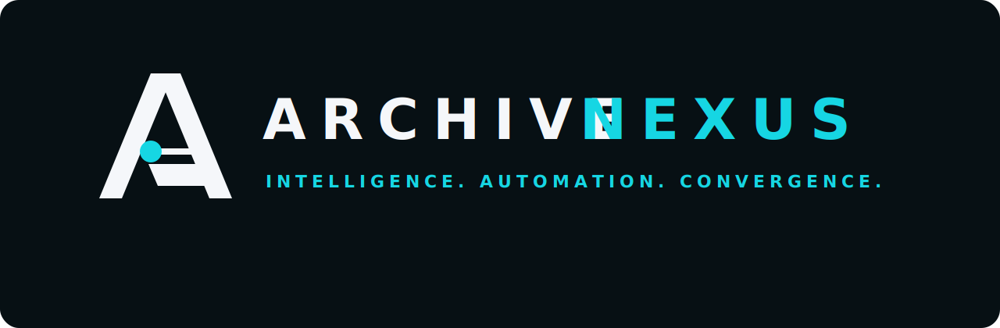

<p align="center">
  
</p>

# Archive-Nexus

Archive-Nexus는 제조·출하 이벤트를 생성하고 물류·정산 흐름으로 연결하는 Manufacturing AX 백엔드입니다.

## Service Role

Archive-Nexus는 Factory A/B/C의 생산, 품질, 재고, 물류, 정비 데이터를 생성하고 운영 API와 대시보드로 노출합니다. 제조 도메인에서 발생한 synthetic event는 Outbox에 저장한 뒤 `eventType` 기준으로 외부 서비스에 라우팅합니다.

- Factory A/B/C 제조 이벤트 생성
- Outbox 기반 이벤트 저장과 재처리 상태 관리
- `eventType` 기반 Archive-Logistics / Archive-Ledger 라우팅
- 외부 서비스 장애 시 제조 API 격리
- ArchiveOS 관제를 위한 status, summary, interaction API 제공

## Core Flow

```text
Factory Runtime
  -> Nexus Outbox
  -> Routing Policy
     -> Logistics events -> Archive-Logistics
     -> Cost/settlement events -> Archive-Ledger
     -> Pre-cost events -> NONE/SKIPPED
```

| Target | Event types | Role |
| --- | --- | --- |
| `LOGITICS` | `LOGISTICS_DISPATCHED`, `URGENT_DELIVERY_REQUESTED`, `SHIPMENT_HOLD_RELEASED`, `MATERIAL_TRANSFER_REQUESTED`, `QUALITY_REPLACEMENT_SHIPMENT` | Route, ETA, delay, logistics cost calculation by Archive-Logistics |
| `LEDGER` | `PRODUCTION_COMPLETED`, `MATERIAL_CONSUMED`, `MAINTENANCE_COMPLETED`, `QUALITY_DEFECT_DETECTED`, `EMERGENCY_PURCHASE_REQUESTED`, `QUALITY_CLAIM_CHARGED`, `CORPORATE_CARD_USED`, `VENDOR_PAYMENT_REQUESTED` | Cost, approval, ledger, settlement input for Archive-Ledger |
| `NONE` | `SHIPMENT_HOLD_CREATED` | Internal pre-cost state, no external publish |
| `UNKNOWN` | Unsupported event type | Not published, reported as skipped/failed routing |

`Archive-Logistics` is the external service name. Internal compatibility values such as `LOGITICS`, `logitics`, and `ARCHIVE_INTEGRATIONS_LOGITICS_*` remain unchanged for existing API, database, and environment compatibility.

## Main APIs

| Method | Path | Purpose |
| --- | --- | --- |
| `GET` | `/api/outbox/summary` | Outbox counts by status and target service |
| `GET` | `/api/integrations/summary` | Archive-Logistics / Archive-Ledger configuration and health summary |
| `GET` | `/api/outbox/events` | Outbox event list with `status` and `targetService` filters |
| `GET` | `/api/outbox/events/{eventId}` | Single outbox event lookup |
| `POST` | `/api/outbox/events/generate?count=100&type=logistics` | Generate synthetic events |
| `POST` | `/api/outbox/events/publish?target=auto&dryRun=true` | Route or publish outbox candidates |
| `GET` | `/api/nexus-economy/summary` | Synthetic revenue, cost, profit, cash balance, and bankruptcy risk summary |
| `POST` | `/api/economy/events/external` | Receive synthetic fee events billed by Archive-Logistics or Archive-Ledger |
| `POST` | `/api/nexus-economy/daily-close?date=YYYY-MM-DD` | Create a synthetic daily profit snapshot |
| `GET` | `/api/archiveos/status` | ArchiveOS availability state |
| `GET` | `/api/platform/manifest` | Archive Suite application contract |

## Operational Principles

- `dryRun=true` must be used before actual publish in demos or manual operations.
- `retry_count`, `last_error`, `last_publish_target`, and `last_publish_attempt_at` preserve retry evidence.
- `target_service` records whether an event is routed to `LOGITICS`, `LEDGER`, `NONE`, or `UNKNOWN`.
- `ARCHIVE_INTEGRATIONS_*_ENABLED=false` is the default; Nexus still starts and manufacturing APIs remain available.
- External service failures must not terminate simulator, dashboard, or manufacturing APIs.
- Economy APIs use synthetic amounts only. They are designed for ArchiveOS Survival Mode and must not be treated as real customer revenue or real financial data.
- External fee events include `eventId`, `idempotencyKey`, `simulationRunId`, `settlementCycleId`, `correlationId`, `causationId`, `hopCount`, and `maxHop` to prevent duplicate processing and recursive fee loops.

## Nexus Economy Model

Archive-Nexus recognizes synthetic production and shipment revenue while recording manufacturing costs and external service fees. ArchiveOS can poll `/api/nexus-economy/summary` to calculate Survival Mode profitability and bankruptcy risk.

```text
Production / Shipment
  -> Nexus revenue events

Material / Maintenance / Quality / Operations
  -> Nexus internal cost events

Archive-Logistics / Archive-Ledger fee billing
  -> /api/economy/events/external
  -> Nexus external cost events
  -> /api/nexus-economy/summary
```

Supported external fee sources:

- `Archive-Logistics`
- `Archive-Ledger`

Supported external fee cost types:

- `LOGISTICS_SERVICE_FEE_PAID`
- `LOGISTICS_DAILY_SETTLEMENT_FEE_PAID`
- `LEDGER_SETTLEMENT_AGENCY_FEE_PAID`
- `LEDGER_RECONCILIATION_FEE_PAID`

See [Nexus economy model](docs/nexus-economy-model.md) and [external fee contract](docs/nexus-external-fee-contract.md).

## Local Run

```powershell
docker compose up --build -d
docker compose ps
```

| Service | URL |
| --- | --- |
| Frontend | `http://localhost:15173` |
| Backend health | `http://localhost:8080/actuator/health` |
| Prometheus | `http://localhost:19090` |
| Grafana | `http://localhost:13000` |

Default external integration values:

```env
ARCHIVE_INTEGRATIONS_LOGITICS_ENABLED=false
ARCHIVE_INTEGRATIONS_LOGITICS_BASE_URL=http://host.docker.internal:8092
ARCHIVE_INTEGRATIONS_LEDGER_ENABLED=false
ARCHIVE_INTEGRATIONS_LEDGER_BASE_URL=http://host.docker.internal:18080
ARCHIVE_INTEGRATIONS_ROUTING_ALLOW_LEDGER_DIRECT_FALLBACK_FOR_LOGISTICS=false
```

Do not commit `.env`, tokens, webhooks, private keys, or local data directories.

## Smoke Test

```powershell
curl.exe "http://localhost:8080/api/outbox/summary"
curl.exe "http://localhost:8080/api/integrations/summary"

curl.exe -X POST "http://localhost:8080/api/outbox/events/generate?count=20&type=logistics"
curl.exe -X POST "http://localhost:8080/api/outbox/events/publish?target=auto&dryRun=true"

curl.exe -X POST "http://localhost:8080/api/outbox/events/generate?count=20&type=ledger"
curl.exe -X POST "http://localhost:8080/api/outbox/events/publish?target=ledger&dryRun=true"
curl.exe "http://localhost:8080/api/nexus-economy/summary"
```

Expected behavior:

- Logistics generation creates events routed to `LOGITICS`.
- Ledger generation creates events routed to `LEDGER`.
- `dryRun=true` returns routing counts without external HTTP calls.
- Disabled external services are reported as `DISABLED`, while Nexus remains `HEALTHY`.

## Verification

```powershell
cd backend
.\gradlew.bat test --no-daemon --console=plain
.\gradlew.bat bootJar --no-daemon --console=plain

cd ..
docker compose config --quiet
```

## Incident Runbook

1. Check `/api/integrations/summary`.
2. Check `/api/outbox/summary`.
3. Inspect failed or retrying events:

```powershell
curl.exe "http://localhost:8080/api/outbox/events?status=PENDING_RETRY"
curl.exe "http://localhost:8080/api/outbox/events?status=FAILED"
```

4. If an external service is down, keep integration disabled or use `dryRun=true`.
5. After recovery, publish only the target that recovered:

```powershell
curl.exe -X POST "http://localhost:8080/api/outbox/events/publish?target=logitics"
curl.exe -X POST "http://localhost:8080/api/outbox/events/publish?target=ledger"
```

## Operations Docs

- [Architecture](docs/architecture.md)
- [Outbox routing](docs/outbox-routing.md)
- [API reference](docs/api-reference.md)
- [Smoke test](docs/smoke-test.md)
- [Operations runbook](docs/operations-runbook.md)
- [Nexus economy model](docs/nexus-economy-model.md)
- [Nexus external fee contract](docs/nexus-external-fee-contract.md)
- [Game economy integration](docs/game-economy-nexus.md)

## Tech Stack

- Java 21, Spring Boot 3, Spring Data JPA
- PostgreSQL, Flyway
- React, Vite, TypeScript, Nginx
- Docker Compose
- Actuator, Prometheus, Grafana

