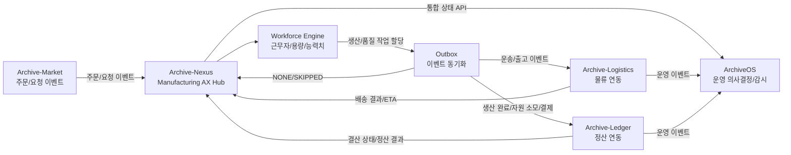

<p align="center">
  
</p>

# Archive-Nexus

## Archive-Nexus 소개

Archive-Nexus는 제조 운영 환경에서 주문 기반 이벤트를 수집·분류·전달하는 **중앙 오케스트레이션 백엔드**입니다. 
Archive-Market에서 들어오는 주문/요청을 기반으로 생산 가용성 판단, 인력/작업 배분, 물류·정산 연동 이벤트를 생성해 `Archive-Logistics`, `Archive-Ledger`, `ArchiveOS`와 연동합니다.

주요 목표는 다음과 같습니다.

- **이벤트 라우팅 허브**: 운영 이벤트를 표준 메시지 스키마로 정규화해 각 도메인 서비스로 일관되게 전달
- **제조 운영 제어면 지원**: 생산 대기열, 근무자/능력치 기반의 작업 배정 시뮬레이션 및 상태 요약 제공
- **신뢰성 있는 이벤트 동기화(Outbox)**: 재시도/상태 추적 가능한 이벤트 관리
- **운영 가시화**: 런타임 이벤트, 요약 지표, 백오피스 성능 상태를 API로 조회 가능

---

## 전체 아키텍처


```mermaid
flowchart LR
  Market[Archive-Market\n주문/요청 이벤트]
  Nexus[Archive-Nexus\nManufacturing AX Hub]
  Workforce[Workforce Engine\n근무자/용량/능력치]
  Outbox[Outbox\n이벤트 동기화]
  Logistics[Archive-Logistics\n물류 연동]
  Ledger[Archive-Ledger\n정산 연동]
  OS[ArchiveOS\n운영 의사결정/감시]

  Market -->|주문/요청 이벤트| Nexus
  Nexus --> Workforce
  Workforce -->|생산/품질 작업 할당| Outbox
  Outbox -->|운송/출고 이벤트| Logistics
  Outbox -->|생산 완료/자원 소모/결제| Ledger
  Outbox -->|NONE/SKIPPED| Nexus
  Logistics -->|배송 결과/ETA| Nexus
  Ledger -->|결산 상태/정산 결과| Nexus
  Nexus -->|통합 상태 API| OS
  Logistics -->|운영 이벤트| OS
  Ledger -->|운영 이벤트| OS
```

---

## 주요 기능

### 1) 제조 운영 자동화

- 공장 A/B/C 시뮬레이션 환경에서 주문 생산/출고 흐름 지원
- 작업 시작/중단 API 기반의 제어 상태 제공
- PostgreSQL/JPA 기반 데이터 지속성
- 기본 모니터링(Prometheus/Grafana) 연동 준비

### 2) Archive-Market 연동

Archive-Market 이벤트를 수신해 Nexus 내부 이벤트로 매핑합니다.

| Market 이벤트 | Nexus 매핑 이벤트 |
| --- | --- |
| `MARKET_ORDER_PLACED` | 주문 접수/검증 흐름 생성 |
| `PRODUCTION_REQUESTED` | 생산 완료/백로그 증가 이벤트 처리 |
| `SHIPMENT_REQUESTED` | 물류 출고/보류 이벤트로 라우팅 |
| `ORDER_CANCELLED` | 취소/반송/예외 처리 라우팅 |
| `RETURN_REQUESTED` | 반품/교체 요청 반영 |
| `QUALITY_CLAIM_CREATED` | 품질 클레임 이벤트 반영 |

Market payload 예시: `orderId`, `customerType`, `riskLevel`, `productType`, `quantity`, `orderAmount`, `priority`, `simulationRunId`, `settlementCycleId`, `correlationId`, `causationId` 등을 바탕으로 Outbox payload를 구성합니다.

### 3) 생산 워크포스 운영

- `PRODUCTION_OPERATOR`, `QUALITY_INSPECTOR`, `MAINTENANCE_ENGINEER`, `MATERIAL_HANDLER`, `FACTORY_MANAGER` 역할 지원
- capacity/할당 상태를 통해 작업 큐 적체와 병목을 분석
- 운영 상태 API: `/api/workforce/summary`, `/api/capacity/summary`, `/api/operations/summary`

### 4) Outbox 라우팅 모델

| 대상 서비스 | 이벤트 예시 | 목적 |
| --- | --- | --- |
| `LOGISTICS` | `LOGISTICS_DISPATCHED`, `URGENT_DELIVERY_REQUESTED`, `SHIPMENT_HOLD_RELEASED`, `MATERIAL_TRANSFER_REQUESTED` | 물류 연동 및 배송 처리 |
| `LEDGER` | `PRODUCTION_COMPLETED`, `MATERIAL_CONSUMED`, `MAINTENANCE_COMPLETED`, `QUALITY_DEFECT_DETECTED` 등 | 재고·자원·정산 동기화 |
| `NONE` | `SHIPMENT_HOLD_CREATED`, `PRODUCTION_DELAYED`, `BACKLOG_INCREASED` | 보류/확인 필요 항목 |
| `UNKNOWN` | 미매핑 이벤트 | 운영 검토 대상 |

대상 식별자는 `LOGITICS`/`logitics`/`ARCHIVE_INTEGRATIONS_LOGITICS_*` 환경설정을 함께 점검해 오타/오동작을 줄입니다.

### 5) Autonomous Runtime Work Loop

`ARCHIVE_RUNTIME_AUTORUN_ENABLED` 플래그를 켜면, 다음 이벤트 흐름을 주기적으로 처리합니다.

- `GET /api/runtime/status`
- `ARCHIVE_RUNTIME_TICK_INTERVAL=30s`
- `ARCHIVE_RUNTIME_MAX_EVENTS_PER_TICK=10`
- `ARCHIVE_RUNTIME_MAX_BACKLOG_PER_TICK=50`

`MARKET_ORDER_PLACED`, `PRODUCTION_REQUESTED`, `SHIPMENT_REQUESTED` 이벤트를 받아 인력·가용량 상태와 Outbox 라우팅을 갱신하고, 상태 요약 API를 노출합니다.

---

## API 목록 (요약)

### Outbox / Runtime

- `GET /api/operations/summary` : 운영 요약(정산/물류/생산 연동 지표)
- `GET /api/runtime/status` : 런타임 루프 상태
- `GET /api/outbox/summary` : Outbox 요약
- `GET /api/outbox/events` : 이벤트 목록(`status`, `targetService` 필터)
- `GET /api/outbox/events/{eventId}` : 이벤트 상세
- `POST /api/outbox/events/generate?count=100&type=logistics` : 시나리오용 이벤트 생성
- `POST /api/outbox/events/publish?target=auto&dryRun=true` : 배포 전 검증
- `POST /api/outbox/events/publish?target=logistics|ledger` : 대상 연동 발행
- `GET /api/integrations/summary` : Archive-Logistics, Archive-Ledger, ArchiveOS, Workforce 연동 상태

### Market API

- `POST /api/events/market` : 단건 이벤트 수신
- `POST /api/events/market/bulk` : 배치 이벤트 수신
- `GET /api/events/market` : Market 이벤트 조회

### Workforce / Productivity

- `POST /api/workforce/allocations` : 작업 배정 생성
- `GET /api/workforce/summary` : workforce 상태 요약
- `GET /api/productivity/summary` : 작업 성과 요약

---

## 실행 환경

- Java 21 기준, Gradle 기반 백엔드
- docker compose 기반 실행
- PostgreSQL + 외부 통합 API 연동 구성

기본 실행 예시

```bash
docker compose -f docker-compose.dev-db.yml up -d
docker compose up -d
```

---

## 보안 및 운영 주의점

- 서비스 계정/키는 코드에 하드코딩하지 않습니다.
- 런타임 예외는 Outbox 상태 및 이벤트 로그로 추적합니다.
- `NONE / SKIPPED / UNKNOWN` 이벤트는 즉시 조치 대상이 아닌 **보류/검토 상태**로 관리합니다.

