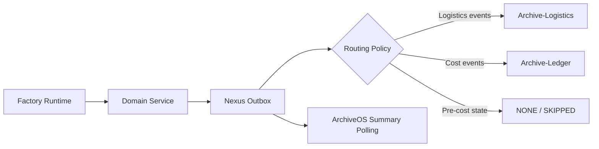

# Archive-Nexus Architecture

Archive-Nexus is a Manufacturing AX service that owns factory simulation, manufacturing domain state, and synthetic event routing. ArchiveOS, Archive-Logistics, and Archive-Ledger are external systems; Nexus must keep manufacturing APIs available even when those systems are degraded or unavailable.

## Runtime Components

| Component | Responsibility |
| --- | --- |
| `backend` | Spring Boot API, simulator runtime, JPA persistence, outbox publisher |
| `frontend` | React/Vite operations dashboard |
| `postgres` | Simulator state, task history, AI query history, outbox events |
| `prometheus` | Backend metrics scraping |
| `grafana` | Local operations dashboard |

## Data Ownership

- Nexus owns Factory A/B/C production, quality, maintenance, inventory, logistics, task, and simulator state.
- Nexus owns `nexus_outbox_event` until an event is published or permanently failed.
- Archive-Logistics owns route, ETA, delivery risk, and logistics cost calculation after receiving logistics events.
- Archive-Ledger owns transaction normalization, approval state, ledger entries, settlement, and reconciliation after receiving financial/cost events.
- ArchiveOS owns control tower status, workflow approval, RAG evidence, and operational interaction logs.

## Event Flow



### Market inbound events

Archive-Market synthetic commerce events are accepted at `/api/events/market` and may produce outbox candidates before normal routing:

```mermaid
flowchart LR
  M[Archive-Market] -->|market event API| N[Market Inbound (nexus_market_event)]
  N -->|mapping| C
  C -->|PRODUCTION_REQUESTED| F
  C -->|SHIPMENT_REQUESTED| E
  C -->|ORDER_CANCELLED| G
  C -->|RETURN_REQUESTED| F
  C -->|QUALITY_CLAIM_CREATED| F
  C -->|MARKET_ORDER_PLACED| N
  C --> H
```

## Routing Contract

The route is derived from `eventType` and stored as `target_service`.

- `LOGITICS`: logistics events routed to Archive-Logistics. The spelling is retained for compatibility with existing DB/API values.
- `LEDGER`: cost and settlement events routed directly to Archive-Ledger.
- `NONE`: internal events with no confirmed external cost.
- `UNKNOWN`: unsupported event types.

## Persistence

Key tables are managed by Flyway migrations:

- `simulator_state`
- `simulator_control_state`
- `nexus_task`
- `nexus_task_log`
- `ai_query_history`
- `audit_log`
- `nexus_outbox_event`

Outbox fields used for operations:

- `event_id`
- `idempotency_key`
- `event_type`
- `target_service`
- `routing_status`
- `status`
- `retry_count`
- `last_error`
- `last_publish_target`
- `last_publish_attempt_at`

## Failure Isolation

Nexus treats external integrations as optional. If Archive-Logistics, Archive-Ledger, or ArchiveOS is disabled or unavailable:

- simulator and manufacturing APIs remain available;
- dashboard keeps loading manufacturing data;
- publish attempts are skipped, dry-run, pending retry, or failed by target;
- failure evidence is stored on outbox events;
- `/api/outbox/summary` and `/api/integrations/summary` remain available for control tower polling.

## External Inbound Integration

- `ARCHIVE_INTEGRATIONS_MARKET_ENABLED` controls acceptance behavior for downsteam publish decisions only.
- Market event acceptance API (`/api/events/market*`) continues to persist events even when downstream integrations are disabled.
- Market duplicate guard uses `idempotencyKey` first, then `eventId`.
- Hop guard (`hopCount > maxHop`) is rejected and persisted as `REJECTED`.
