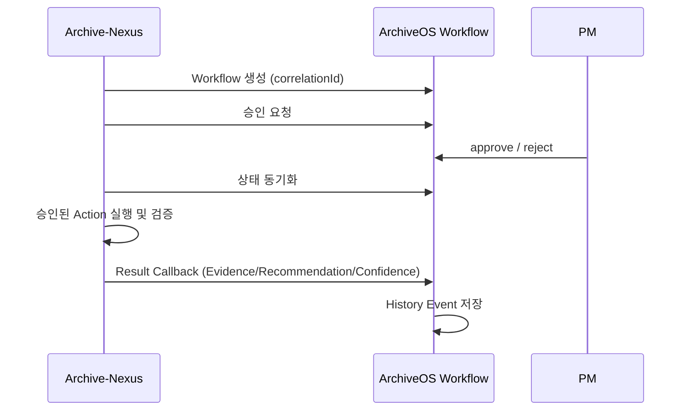

# ArchiveOS 양방향 Workflow 연동

Archive Nexus는 ArchiveOS를 직접 포함하지 않는다. 기존 Interaction adapter와 별도의 `ArchiveOsWorkflowClient` 계약을 통해 플랫폼 기능을 호출한다.



승인 대기 작업은 기본 5초 간격으로 동기화한다. 호출은 2초 timeout, 최대 3회 bounded retry를 사용한다. ArchiveOS가 응답하지 않으면 Nexus 작업은 `RETRY_REQUESTED`로 남고 제조 조회·시뮬레이터는 계속 동작한다.

## Runtime 상태 확인

Nexus backend는 `ARCHIVEOS_BASE_URL`의 `/api/health`를 짧은 timeout으로 조회하고
`GET /api/archiveos/status`에서 `AVAILABLE`, `DEGRADED`, `UNAVAILABLE` 상태를 반환한다.
로컬 Compose 기본 주소는 실제 ArchiveOS Node API 포트에 맞춘
`http://host.docker.internal:4000`이다. `ARCHIVEOS_TIMEOUT_MS`의 기본값은 2000ms다.

이 상태 확인은 제조 시뮬레이션과 도메인 API 실행 경로에서 분리된다. ArchiveOS가 중단되거나
일부 선택 서비스가 degraded여도 Nexus 제조 데이터와 화면은 계속 제공되며, 화면 상단과
Settings에서 연동 상태와 확인 메시지를 표시한다.

## Adapter 계약

- `sendEvent()`: 제조 이벤트 또는 이상 알림 전송
- `requestRagAnalysis()`: RAG 근거 조회
- `createRpaTask()`: 지능형 RPA 작업 생성
- `updateRpaStatus()`: RPA 상태 동기화
- `requestApproval()`: 승인 게이트 요청
- `publishAlert()`: 관제 알림 발행

## Mock 전략

초기 MVP에서는 `MockArchiveOsClient`가 RAG 근거와 RPA Task 생성을 대체한다. 실제 ArchiveOS API가 준비되면 동일 interface를 구현하는 HTTP 또는 SDK adapter를 추가한다.

Mock adapter는 다음 상호작용을 `GET /api/archiveos/interactions`로 노출한다.

- `SEND_EVENT`
- `ALERT_PUBLISH`
- `RAG_SEARCH`
- `RPA_TASK_CREATE`
- `APPROVAL_REQUEST`
- `RPA_STATUS_UPDATE`

정상 생산, 재고, 품질, 물류 데이터는 이 로그를 만들지 않는다. 이상 감지로 `FactoryAlert`가 생성된 경우에만 ArchiveOS 상호작용이 기록된다.

## 향후 연동

- ArchiveOS AI Runtime 분석 요청
- Spring Batch 실행 이력 저장
- RAG index 기반 작업 표준서 검색
- Approval Gate 승인/반려 webhook
- RPA 실행 결과와 재시도 로그 저장

## 크리티컬 Discord 알림

Nexus 작업 실패 또는 Agent 결과가 승인을 요구할 때만 Discord webhook을 호출한다. URL은
`ARCHIVE_NEXUS_DISCORD_WEBHOOK_URL`로 주입하며 미설정 환경에서는 실행을 방해하지 않고 skip한다.

## Multi-Agent Interaction

Manufacturing Orchestrator는 Nexus 내부에서 Agent를 실행하고 다음 lifecycle event를 기존 interaction log에 남긴다.

- `AGENT_QUERY_RECEIVED`
- `AGENT_ROUTED`
- `AGENT_EXECUTION_STARTED`
- `AGENT_EXECUTION_COMPLETED`
- `AGENT_EXECUTION_FAILED`
- `AGENT_RESPONSE_COMPOSED`

분석에서 조치가 필요하면 기존 RPA task 목록에 `source=MULTI_AGENT` task를 추가한다. task에는 `sourceQueryId`, priority, reason, recommended action, evidence, approval 필요 여부가 포함된다. ArchiveOS 원격 Agent 실행은 아직 사용하지 않으며, interaction event가 추후 중앙 관제 연결점이다.

## Docker host resolution

Windows Docker Desktop에서는 `host.docker.internal`이 기본 제공되므로 Nexus backend 컨테이너가
host의 ArchiveOS Node API `http://host.docker.internal:4000`으로 접근할 수 있다.

Linux Docker Engine에서는 동일 이름이 기본 제공되지 않을 수 있어 Compose에 다음 mapping을 둔다.

```yaml
extra_hosts:
  - "host.docker.internal:host-gateway"
```

ArchiveOS가 다른 host 또는 별도 Docker network에서 실행된다면 코드 변경 대신 `ARCHIVEOS_BASE_URL`을
해당 주소로 override한다.
