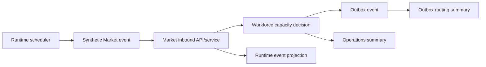

# Autonomous Runtime Work Loop

Archive-Nexus는 ArchiveOS Live Flow에서 서비스가 정지된 것처럼 보이지 않도록 제한된 속도의 synthetic runtime work loop를 제공한다.

이 기능은 실제 고객, 결제, 금융, 직원 데이터를 만들지 않는다. 모든 이벤트와 금액은 Synthetic Runtime Data / Demo Data다.

## 목적

- 정상 기동 중인 Nexus가 Market-origin 생산/출하 흐름을 조금씩 진행한다.
- 생성된 work는 기존 Market inbound, Workforce capacity, Outbox routing 경로를 그대로 사용한다.
- ArchiveOS는 runtime event, operations summary, outbox summary를 read-only로 수집한다.
- summary GET API는 데이터를 생성하거나 변경하지 않는다.

## 설정

```yaml
archive:
  runtime:
    autorun:
      enabled: false
    tick-interval: 30s
    max-events-per-tick: 10
    max-backlog-per-tick: 50
```

Docker Compose local/demo 환경은 `ARCHIVE_RUNTIME_AUTORUN_ENABLED=true`를 기본값으로 둔다. 운영 환경에서는 명시적으로 판단해 켜야 한다.

환경 변수:

```text
ARCHIVE_RUNTIME_AUTORUN_ENABLED=true
ARCHIVE_RUNTIME_TICK_INTERVAL=30s
ARCHIVE_RUNTIME_MAX_EVENTS_PER_TICK=10
ARCHIVE_RUNTIME_MAX_BACKLOG_PER_TICK=50
```

## Tick 동작

한 tick은 최대 `max-events-per-tick`개까지 synthetic Market-origin work를 생성한다.

기본 생성 후보:

1. `MARKET_ORDER_PLACED`
2. `PRODUCTION_REQUESTED`
3. `SHIPMENT_REQUESTED`

각 이벤트는 `MarketEventService.receive()`로 수신되므로 기존 처리 경로를 그대로 통과한다.



## 멱등성과 안전장치

- tick bucket 기반 `eventId` / `idempotencyKey`를 사용한다.
- 동일 tick이 중복 실행되어도 기존 Market inbound duplicate guard가 중복 저장을 막는다.
- `correlationId`, `causationId`, `simulationRunId`, `settlementCycleId`, `hopCount`, `maxHop`을 포함한다.
- scheduler lock으로 동시 tick 실행을 막는다.
- `max-events-per-tick`, `max-backlog-per-tick`으로 이벤트 폭증을 제한한다.
- 외부 publish는 기존 integration enabled 설정과 outbox publisher 정책을 따른다.

## Runtime status API

```http
GET /api/runtime/status
```

응답 예:

```json
{
  "service": "Archive-Nexus",
  "runtimeActive": true,
  "autoRunEnabled": true,
  "schedulerStatus": "IDLE",
  "lastWorkAt": "2026-07-11T00:00:00Z",
  "lastEventAt": "2026-07-11T00:00:00Z",
  "eventsProducedLastTick": 3,
  "eventsConsumedLastTick": 3,
  "backlogCount": 12,
  "pipelineStatus": "LIVE"
}
```

## Operations summary

`GET /api/operations/summary`에는 `runtime` 섹션이 포함된다.

- `runtime.autoRunEnabled`
- `runtime.schedulerStatus`
- `runtime.lastWorkAt`
- `runtime.lastEventAt`
- `runtime.eventsProducedLastTick`
- `runtime.eventsConsumedLastTick`
- `runtime.backlogCount`
- `runtime.pipelineStatus`

## 주의

- heartbeat만 무한히 쌓지 않는다.
- 가능하면 실제 synthetic business flow인 Market → Nexus → Workforce → Outbox 경로를 진행한다.
- summary API는 read-only다.
- 실제 개인정보/결제정보/금융정보/직원정보를 저장하지 않는다.
