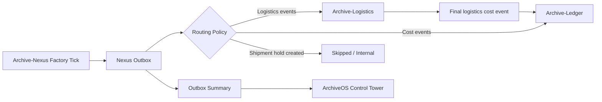

# Demo: Nexus to Logistics to Ledger

This scenario shows the intended ecosystem flow without putting Archive-Logistics or Archive-Ledger
inside the Archive-Nexus Docker Compose file.

## 1. Start external services

Start Archive-Logistics on `8092` and Archive-Ledger on `18080` from their own repositories.

Expected health checks:

```powershell
curl.exe "http://localhost:8092/actuator/health"
curl.exe "http://localhost:18080/actuator/health"
```

## 2. Start Archive-Nexus

```powershell
docker compose up --build -d
```

Enable external routing through `.env` or shell variables:

```env
ARCHIVE_INTEGRATIONS_LOGITICS_ENABLED=true
ARCHIVE_INTEGRATIONS_LOGITICS_BASE_URL=http://host.docker.internal:8092
ARCHIVE_INTEGRATIONS_LEDGER_ENABLED=true
ARCHIVE_INTEGRATIONS_LEDGER_BASE_URL=http://host.docker.internal:18080
ARCHIVE_INTEGRATIONS_ROUTING_ALLOW_LEDGER_DIRECT_FALLBACK_FOR_LOGISTICS=false
```

## 3. Generate logistics events

```powershell
curl.exe -X POST "http://localhost:8080/api/outbox/events/generate?count=100&type=logistics"
```

## 4. Dry-run routing

```powershell
curl.exe -X POST "http://localhost:8080/api/outbox/events/publish?target=auto&dryRun=true"
curl.exe "http://localhost:8080/api/outbox/summary"
curl.exe "http://localhost:8080/api/integrations/summary"
```

## 5. Publish to Archive-Logistics

```powershell
curl.exe -X POST "http://localhost:8080/api/outbox/events/publish?target=logitics"
curl.exe "http://localhost:8092/api/operations/summary"
curl.exe "http://localhost:8092/api/outbox/summary"
```

Archive-Logistics should calculate route/cost and then publish finalized logistics cost events to Archive-Ledger.

## 6. Generate direct Ledger events

```powershell
curl.exe -X POST "http://localhost:8080/api/outbox/events/generate?count=100&type=ledger"
curl.exe -X POST "http://localhost:8080/api/outbox/events/publish?target=ledger"
curl.exe "http://localhost:18080/api/operations/summary"
curl.exe "http://localhost:18080/api/transactions"
```

## 7. ArchiveOS control tower reads Nexus

ArchiveOS can poll these Nexus endpoints:

```powershell
curl.exe "http://localhost:8080/api/outbox/summary"
curl.exe "http://localhost:8080/api/integrations/summary"
curl.exe "http://localhost:8080/api/outbox/events?targetService=LOGITICS"
curl.exe "http://localhost:8080/api/outbox/events?targetService=LEDGER"
curl.exe "http://localhost:8080/api/outbox/events?status=FAILED"
curl.exe "http://localhost:8080/api/outbox/events?status=PENDING_RETRY"
```

## Mermaid flow


