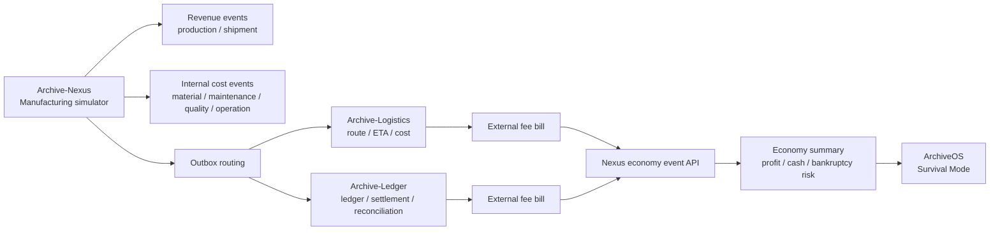

# Game Economy: Archive-Nexus

Archive Platform Survival Mode treats each service as an operating company in a synthetic ecosystem. Archive-Nexus is the manufacturing company: it earns production/shipment revenue and pays material, maintenance, quality, operation, logistics, and ledger fees.

This is a simulation feature. It does not represent real company finance, customer revenue, delivery records, or user data.

## Nexus Role

Archive-Nexus:

- creates manufacturing and shipment events
- routes logistics events to Archive-Logistics
- routes cost/settlement events to Archive-Ledger
- records its own synthetic revenue and cost events
- receives synthetic fee bills from Archive-Logistics and Archive-Ledger
- exposes an economy summary for ArchiveOS Survival Mode

## Economy Flow



## Safe Simulation Rules

| Rule | Purpose |
| --- | --- |
| Synthetic data only | Prevents real finance/customer data from entering demos |
| `eventId` uniqueness | Prevents duplicate economy records |
| `idempotencyKey` uniqueness | Makes retries safe |
| `hopCount` and `maxHop` | Prevents circular fee loops |
| Fee receipt does not emit another fee | Prevents service-to-service infinite loops |
| Existing Outbox routing remains unchanged | Keeps manufacturing event flow stable |

## Survival Mode Inputs

ArchiveOS can use:

```http
GET /api/nexus-economy/summary
GET /api/nexus-economy/profit-snapshots
GET /api/integrations/summary
```

The summary contains:

- total revenue
- total cost
- profit
- cash balance
- bankruptcy risk
- revenue by type
- cost by type

## Daily Close

```http
POST /api/nexus-economy/daily-close?date=YYYY-MM-DD
```

Daily close creates a profit snapshot for a specific date. Snapshots are useful for Survival Mode timelines and portfolio demos.

## Integration Boundary

Archive-Nexus does not calculate Archive-Logistics route economics or Archive-Ledger settlement economics. It only receives the final synthetic fee bills that those services decide to charge.

This keeps service responsibilities separate:

- Nexus: manufacturing source and payer
- Logistics: route/cost calculator and logistics fee issuer
- Ledger: settlement/reconciliation agency and ledger fee issuer
- ArchiveOS: control tower and Survival Mode operator
