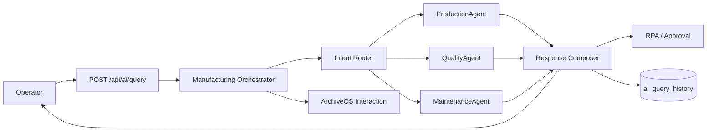

# Manufacturing Multi-Agent Architecture

## 기존 구조 분석

멀티 Agent는 기존 제조 시뮬레이터를 대체하지 않고 읽기 전용 분석 계층으로 추가한다.

| 기존 구조 | 현재 역할 | Agent 재사용 방식 |
|---|---|---|
| `NexusStateService` | Factory, 생산, 센서, 품질, 재고, 물류, 정비, RPA, Batch runtime state 소유 | Agent가 production orders, inspections, sensor metrics, maintenance events 조회 API 호출 |
| `SimulatorStateStore` | `simulator_state` PostgreSQL snapshot 저장·복구 | Agent는 직접 접근하지 않으며 기존 runtime state를 조회 |
| `MockArchiveOsClient` | RAG/RPA/승인/알림 및 ArchiveOS interaction 기록 | Orchestrator lifecycle event와 Agent 기반 RPA 기록 |
| `FactoryAlert` 규칙 | 센서, 품질, 재고, 물류 이상 감지 결과 | Dashboard anomaly와 Agent 근거로 조회 |
| `RpaTask` | 이상 조치와 승인 상태 | `source=MULTI_AGENT`, `sourceQueryId`, 근거와 권장 조치를 포함해 재사용 |
| `BatchSnapshot` | 5 tick 단위 운영 집계 | Agent가 수정하지 않으며 Dashboard/모니터링에서 유지 |
| `NexusMetrics` | simulator, anomaly, RPA, persistence 지표 | `AiMetrics`가 동일 registry에 Agent 지표만 추가 |

현재 Production, Quality, Maintenance 데이터는 별도 JPA aggregate가 아니라 simulator runtime snapshot 안에서 관리된다. 따라서 Agent 내부에 생산·품질·정비 데이터를 복제하거나 새로 생성하지 않고 `NexusStateService`의 기존 상태를 분석한다.

## 실행 흐름

1. Orchestrator가 correlation/query ID와 `AgentContext`를 생성한다.
2. Intent Router가 `PRODUCTION`, `QUALITY`, `MAINTENANCE`, `UNKNOWN` 중 하나 이상을 반환한다.
3. 선택된 독립 Agent를 최대 3개 고정 worker에서 병렬 실행한다.
4. Agent 실패는 `FAILED` 결과로 격리하고 다른 Agent 실행을 중단하지 않는다.
5. Response Composer가 성공 결과, 근거, 권장 조치와 신뢰도를 통합한다.
6. 조치가 필요하면 기존 RPA/승인 흐름에 task를 추가한다.
7. 최종 응답과 Agent 결과를 PostgreSQL에 저장한다.

## Intent Router

Spring context에 `ChatModel` bean이 있으면 제한된 intent 목록을 반환하도록 분류 prompt를 호출한다. 응답이 비어 있거나 모델 호출이 실패하거나 모델이 없으면 deterministic keyword/rule fallback을 사용한다. `UNKNOWN`과 다른 intent가 함께 반환되면 `UNKNOWN`은 제거한다.

질문의 `1공장`, `2공장`, `3공장`은 각각 `FAC-A`, `FAC-B`, `FAC-C`로 해석한다. 명시된 factory ID가 유효하지 않거나 찾을 수 없으면 전체 공장을 기본 분석 범위로 사용한다. 기본 시간 범위는 `RECENT_20_TICKS`다.

## Agent 계약

`ManufacturingAgent`는 이름, 지원 Intent, 분석 함수, 우선순위를 제공한다. `AgentResult`에는 다음 값이 포함된다.

- Agent/Intent
- 요약
- 구조화된 evidence
- 권장 조치
- confidence
- 실행 시간
- `COMPLETED`, `INSUFFICIENT_DATA`, `FAILED` 상태
- 오류와 조치 필요 여부

데이터가 없으면 추정값을 만들지 않고 `INSUFFICIENT_DATA`와 “판단할 데이터가 부족함”을 반환한다.

## 데이터와 실행 경계

- Agent는 제조 데이터를 수정하지 않는다.
- Orchestrator만 실행 이력, ArchiveOS interaction, RPA task를 생성한다.
- 실제 Agent 원격 실행은 이번 범위에 포함하지 않는다.
- Inventory, Logistics, Forecast Agent는 구현하지 않는다.
- executor는 core/max 3, queue 24로 제한해 무제한 thread 생성을 막는다.

## API

- `POST /api/ai/query`: routing, Agent 실행, 응답 구성, 이력 저장
- `GET /api/ai/queries`: 최신순 전체 Query History
- `GET /api/ai/queries/{id}`: 저장된 실행 상세
- `GET /api/ai/summary`: Dashboard용 Query, 실행 중 Agent, 실패, RPA, 최근 권장 조치
