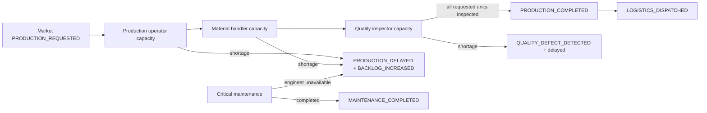

# Workforce Driven Manufacturing Runtime

Archive-Nexus는 Archive-Market의 synthetic production request를 단순 완료 이벤트로 바꾸지 않는다. 요청은 아래의 용량 제한 제조 체인을 통과한다.

## Tick work

local/demo autorun은 제한된 수량의 `MARKET_ORDER_PLACED`와 `PRODUCTION_REQUESTED`를 Market inbound으로 수신한다. 생산 요청 하나는 다음을 실제로 수행한다.

1. 생산 운영자 용량 차감
2. 자재 담당 용량 차감과 `MATERIAL_CONSUMED` 생성
3. 품질 검사 용량 차감과 `QUALITY_INSPECTION_COMPLETED` 생성
4. synthetic critical maintenance가 필요한 경우 정비 인력 용량 확인
5. 품질 검사까지 완료된 수량만 `PRODUCTION_COMPLETED`로 확정
6. 전체 요청량이 확정되고 `requiresShipment=true`일 때만 `LOGISTICS_DISPATCHED` 생성
7. 부족분은 `PRODUCTION_DELAYED`, `BACKLOG_INCREASED`로 남기며, 품질 부족은 `QUALITY_DEFECT_DETECTED`로 Ledger에 전달

`MATERIAL_CONSUMED`, `MAINTENANCE_COMPLETED`, `QUALITY_DEFECT_DETECTED`, `PRODUCTION_COMPLETED`는 Archive-Ledger direct 대상이다. `LOGISTICS_DISPATCHED`는 Archive-Logistics 대상이다. `QUALITY_INSPECTION_COMPLETED`, `PRODUCTION_DELAYED`, `BACKLOG_INCREASED`, `MAINTENANCE_REQUIRED`는 비용 확정 전 운영 상태라 외부 publish를 skip한다.

## 운영 균형

`GET /api/operations/summary`의 `economy`는 persisted synthetic outbox의 최근 1,000건과 workforce 비용만으로 계산한다. 따라서 장기 재무제표가 아니라 현재 운영 윈도우의 합성 런타임 추정치이며, 새 이벤트가 오래된 이벤트를 대체하면 값은 변할 수 있다.

- manufacturingRevenue
- materialCost / maintenanceCost / qualityLossCost / logisticsFee / workforceCost
- operatingProfit / operatingMargin / cashBalance
- qualityDefectRate / downtimeRate / negativeProfitStreak

목표 operating margin의 참고 범위는 5~12%이며, 이 값은 synthetic runtime 운영 판단용이지 실제 재무제표가 아니다. `cashBalance`도 같은 window의 순운영 현금 효과를 나타내며, 임의의 시작 잔액을 더하지 않는다. `workforce.capacityUtilization`, production requested/completed/backlog, bottleneck role은 같은 summary에 함께 제공된다.

## 안전성

- workday + role 중복 allocation 방지
- orderId 기준 `PRODUCTION_COMPLETED` 중복 outbox 방지
- workload별 실제 capacity 차감
- 품질 검사되지 않은 수량은 Logistics 출하를 생성하지 않음
- `hopCount > maxHop` 거부, eventId/idempotencyKey 중복 방지
- ArchiveOS/Logistics/Ledger 미가용은 제조 처리 rollback 조건이 아님
